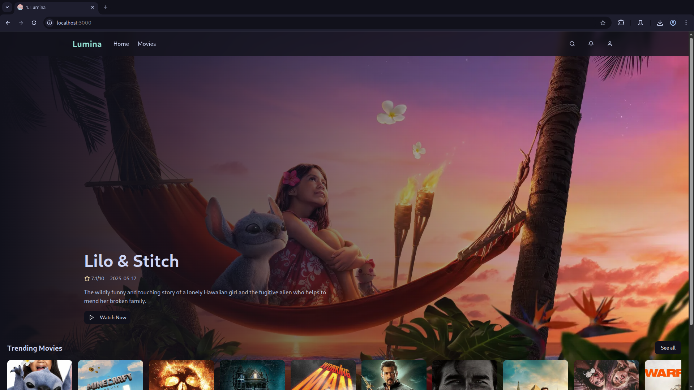

# 🌟 Lumina

**Stream Movies & TV Shows Without Ads — Effortlessly.**

 <!-- Replace with your actual screenshot -->

---

## ✨ Overview

**Lumina** is a sleek, modern movie and TV show streaming platform built with **Next.js**. The goal is simple: provide users with a smooth, distraction-free viewing experience — no ads, no clutter, just content.

---

## 🚀 Features

- 🎬 Watch your favorite **movies** and **TV shows** instantly
- 🚫 100% **ad-free** streaming experience
- ⚡ Built with **Next.js** for blazing-fast performance
- 📱 Fully **responsive design** — works on all devices
- 🌙 Very Pretty UI
- 🔍 Powerful search and filtering 
- 🧠 Smart content suggestions 

---

## 🧑‍💻 Tech Stack

| Tech | Purpose |
|------|---------|
| [Next.js](https://nextjs.org/) | React Framework for SSR & routing |
| [React](https://reactjs.org/) | UI Components |
| [Tailwind CSS](https://tailwindcss.com/) | Utility-first CSS styling |
| [Docker](https://www.docker.com/) | Delivery |
| [GitHub Actions](https://github.com/features/actions) | CI/CD |
| [AWS Lightsail](https://aws.amazon.com/lightsail/) | Hosting |


<!-- --- -->
<!---->
<!-- ## 📸 Preview -->
<!---->
<!---->
<!-- --- -->
<!---->
<!-- ## 📦 Getting Started -->
<!---->
<!-- ```bash -->
<!-- # Clone the repo -->
<!-- git clone https://github.com/roirepus/lumina.git -->
<!-- cd lumina -->
<!---->
<!-- # Install dependencies -->
<!-- npm install -->
<!---->
<!-- # Run development server -->
<!-- npm run dev -->
